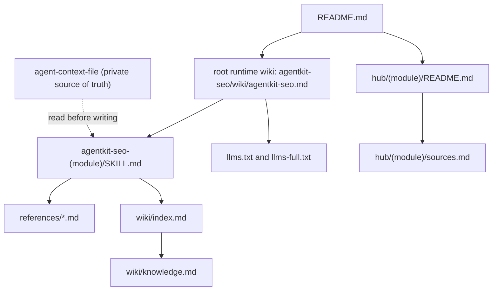

# How AgentKit SEO is built

This document explains the thinking behind AgentKit SEO: the problem it targets, the agentic-AI concepts it deliberately applies, the knowledge-graph structure that holds it together, and how that design has evolved release by release.

It is written for a reader who wants to understand the project quickly, including engineers and recruiters evaluating the work, without reading the whole codebase. For the maintainer-facing edit map, see [architecture-map.md](./.assets/docs/architecture-map.md). For the public overview, see [README.md](./README.md).

## At a glance

- **What it is:** a portable skill bundle that installs into AI coding agents (Claude Code, Codex, Gemini CLI, Antigravity, OpenCode) and helps optimize a developer's public career surfaces: GitHub, LinkedIn, CV/ATS, web portfolio, and X/Twitter.
- **The problem:** most agents can already rewrite a CV or a bio, but the output drifts between tools, invents facts, and ignores platform constraints. Consistency and grounding are the hard parts.
- **The core idea:** keep one private, verified source of truth, an agent-context-file, and have every platform skill read it before writing. This is the same pattern as a repository `AGENTS.md` or `CLAUDE.md`, applied to a career.
- **What makes it interesting:** the project is not a prompt collection. It is a small system that applies current ideas from agentic AI, an LLM-readable knowledge layer, progressive context loading, a cross-referenced knowledge graph, and explicit evidence labeling, and ships them as a validated, versioned package.

## Agentic-AI concepts applied

AgentKit SEO is, in part, a place to apply and pressure-test ideas from the agentic-AI field. Each concept below is implemented in the repository, not just described.

The following table maps each concept to its origin and to where it lives in the source tree.

| Concept | One-line idea | Where it lives |
| --- | --- | --- |
| Career context file | A private `AGENTS.md` for a person: verified facts an agent reads before writing | [`agentkit-seo-agent-context-optimization`](./.skills/agent-skill/agentkit-seo-agent-context-optimization/SKILL.md) |
| LLM Wiki | A knowledge base a maintainer agent compiles from sources and keeps current, read by runtime agents rather than re-derived per query | [`*/wiki/`](./.skills/agent-skill/agentkit-seo/wiki/agentkit-seo.md), [`llms-full.txt`](./llms-full.txt) |
| Progressive disclosure | Load one module, then only the references and wiki a task needs | `## Wiki context` and token-discipline sections in each `SKILL.md` |
| Markdown knowledge graph | Cross-referenced `.md` files with one entrypoint and explicit edges | [`references/`](./.skills/agent-skill/agentkit-seo/references/) link graph, [`llms.txt`](./llms.txt) |
| Evidence and confidence labels | Mark each claim as verified, inferred, or needing evidence | `Boundaries` sections and `wiki/` confidence metadata |
| One source, many adapters | Keep one portable source of truth, generate per-provider layouts | [`.skills/agent-skill/`](./.skills/agent-skill/) plus [`.skills/providers/`](./.skills/providers/) |
| AI-answer-engine readiness (GEO/AEO) | Structure each surface so AI search and assistants can quote a person accurately | per-module AI-readability guidance ([GitHub](./hub/github/copilot-and-agents.md), [LinkedIn](./hub/linkedin/ai-agent-optimization.md), [portfolio](./hub/web-portfolio/llms-and-aeo.md)) |

### Career context file as an `AGENTS.md` for a person

Developers already accept that a repository should carry a context file so an agent understands the codebase before editing it. AgentKit SEO applies that pattern to a career: a private Markdown file holds verified identity facts, roles, projects, metrics, links, target roles, and positioning. Platform skills read that file first, then adapt the same facts to each surface. This keeps output consistent across LinkedIn, GitHub, CV, and portfolio instead of rebuilding a professional history in every chat.

### LLM Wiki: knowledge the model reads, not writes

The wiki layer follows the LLM Wiki framing associated with Andrej Karpathy: a maintainer agent compiles knowledge from official sources and keeps it current, and runtime agents read that compiled knowledge rather than re-deriving it from training data on every query. Without it, an agent guesses platform constraints, ATS parser behavior, field limits, and ranking signals, and produces confident but wrong advice. Each module ships `wiki/` entries with canonical definitions, platform constraints, known failure modes, and review dates, bundled for tools as [`llms-full.txt`](./llms-full.txt).

This adapts Karpathy's design to a shipped package. His LLM Wiki is a personal, ever-growing second brain an agent accumulates from a user's own ingested sources; AgentKit SEO instead ships a curated, versioned knowledge pack about external platform behavior, refreshed by the maintainer-only `agentkit-seo-wiki-maintenance` skill (ingest and lint) rather than mutated during end-user sessions. It keeps the faithful core, compile-once and keep-current instead of per-query retrieval, while deliberately dropping per-user accumulation that does not fit a distributed package.

### Progressive disclosure and token discipline

Loading every skill into context is wasteful and noisy. Each `SKILL.md` declares, in a `## Wiki context` section, exactly when deeper wiki or reference files should be loaded, so an agent pulls detail only when the current task needs it. The orchestrator routes a request to a single module by default and asks for the smallest missing input set rather than demanding every asset upfront.

### A Markdown knowledge graph

The repository is organized as a navigable graph of Markdown files rather than a flat folder. A single runtime entrypoint, the root wiki, points to module skills, which point to their references and wiki entries, which point to human-readable playbooks and source notes. The edges are explicit relative links, so both humans and agents can traverse from a broad question down to a specific constraint without loading everything. The graph is drawn in the next section.

### Evidence and confidence labeling

Career advice is only useful if its certainty is visible. Cross-surface output labels major claims as verified, from context, from a supplied source, official or current source, inference, needs evidence, or inaccessible. Wiki entries carry confidence values and `last_reviewed` dates, and the `doctor` command validates that metadata. The goal is to separate documented platform behavior from inference instead of presenting everything as fact.

### One portable source, thin provider adapters

Runtime methodology lives once in [`.skills/agent-skill/`](./.skills/agent-skill/). Provider folders stay thin: install notes, command wrappers, and metadata. The export CLI generates each provider's required layout from the single source, so the same methodology installs into six environments without a second copy drifting out of sync.

### AI-answer-engine readiness (GEO/AEO)

Career discovery increasingly happens inside AI answer engines: people and recruiters ask an assistant rather than scanning a list of links. Generative engine optimization and answer engine optimization are the current names for being quoted accurately in those answers. AgentKit SEO does not chase a ranking trick for this; the same properties it already enforces, consistent facts across surfaces, explicit structure, and verifiable proof, are exactly what an answer engine needs to cite a person without inventing or contradicting details. Each platform module already carries surface-specific AI-readability guidance, from GitHub Copilot indexing to LinkedIn AI-readable structure to portfolio AEO. The project treats this as an evolving practice and labels it as such, rather than promising placement in any AI answer.

## The knowledge graph

The intended read path is hierarchical. A broad question enters at the root and narrows to one module and one constraint, instead of loading the whole system.

Two properties matter here. First, there is one entrypoint: the root wiki decides which module to load before any module detail is read. Second, the deepest knowledge, module `wiki/knowledge.md`, is only reached when a task actually needs it, which keeps routine work cheap in context.

## How the design evolved

The project is also a record of continuous study: each release line adopted a new idea once it proved useful. The full history is in [CHANGELOG.md](./CHANGELOG.md); the summary below traces the concepts rather than the patches.

- **0.1.x, foundations.** Shipped the package with tag-based npm publishing, a guided context-file template, install manifests, and a `doctor` validation command. The bet here was context-first work plus reproducible packaging.
- **1.5.x, distribution as adapters.** Hardened multi-provider install and export, added the Gemini-compatible extension layout and the Antigravity plugin layout, and kept one source of truth behind thin adapters.
- **1.6.x, the knowledge layer.** Added the LLM Wiki layer for every module, the root self-description, conditional wiki loading, shared evidence labels, and `llms.txt` and `llms-full.txt`. This is where the project became a navigable knowledge graph rather than a set of prompts.
- **1.7.x, operational rigor.** Added a manifest-driven lifecycle to the CLI: `update` compares an installed bundle against the npm registry, and `uninstall` removes exactly what an install created. Reproducibility and clean removal became first-class.

## Sources and influences

These are influences rather than guarantees. AgentKit SEO does not claim ranking outcomes; it applies documented patterns and labels uncertainty.

- The LLM Wiki framing, knowledge the model reads rather than writes, is associated with Andrej Karpathy's commentary on building knowledge for language models.
- The context-file pattern follows the repository `AGENTS.md` and `CLAUDE.md` convention for giving agents project context before they act.
- Progressive disclosure follows the agent-skill design idea that an agent should load instructions and reference material only when a task needs them.
- The audit scoring pattern (weighted categories rolled into a 0-100 band with a fix-first ranking) is adapted from open generative-engine-optimization tooling such as the geo-optimizer skill, and used here strictly as an internal prioritization heuristic, not a platform metric.
- `llms.txt` and `llms-full.txt` follow an emerging community convention for exposing an AI-readable map of a site or package. As of 2026 its adoption is still limited and its measured effect on AI citations is unproven, so this project ships it as a low-cost, honestly-labeled convention (an inferred, low-confidence signal) rather than a search-ranking lever.

---

See also: [README.md](./README.md), [architecture-map.md](./.assets/docs/architecture-map.md), [project.md](./.assets/docs/project.md), and [MAINTAINING.md](./MAINTAINING.md).
