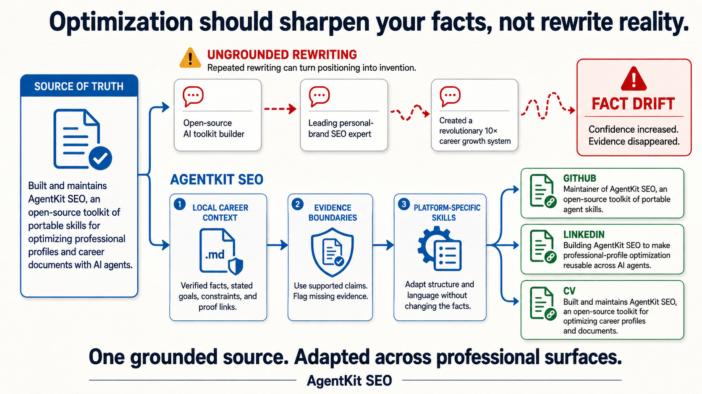
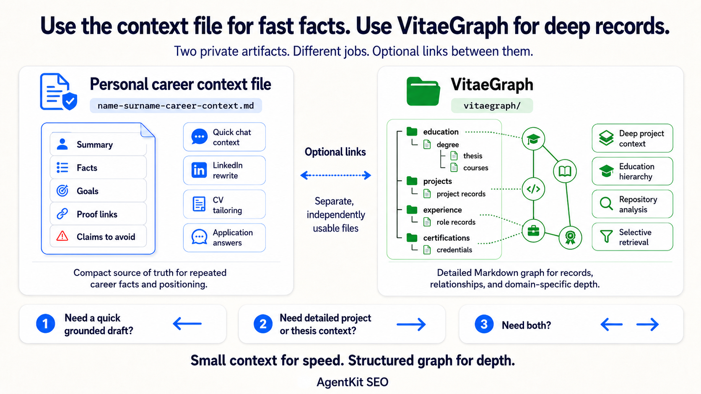

<p align="center">
  
</p>

<p align="center">
  <strong>Give career agents one source of truth, platform-specific guidance, and a repeatable workflow.</strong>
</p>

<p align="center">
  <a href="https://www.npmjs.com/package/agentkit-seo"></a>
  <a href="#modules"></a>
  <a href="https://github.com/agentkit-seo/agentkit-seo/actions/workflows/validate.yml"></a>
  <a href="https://github.com/agentkit-seo/agentkit-seo/stargazers"></a>
  <a href="./LICENSE"></a>
</p>

<p align="center">
  <a href="#why-agentkit-seo">Why</a> •
  <a href="#how-it-works">How it works</a> •
  <a href="#quick-start">Quick start</a> •
  <a href="#vitaegraph">VitaeGraph</a> •
  <a href="#modules">Modules</a> •
  <a href="#install">Install</a> •
  <a href="#documentation">Documentation</a> •
  <a href="https://agentkit-seo.github.io/">Website</a>
</p>

---

## Why AgentKit SEO

Every new AI chat starts with the same problem: the agent does not know which career facts are current, which claims have evidence, what role is being targeted, or how the output should change for each platform.

The usual result is repeated explanation, inconsistent profiles, generic writing, and occasionally invented claims.

AgentKit SEO applies the familiar `AGENTS.md` and `CLAUDE.md` pattern to professional identity. Its context-optimization skill turns a user's raw career material into a private Markdown source of truth called a **personal career context file**. Focused skills then adapt that file for LinkedIn, GitHub, CV/ATS, web portfolios, and X/Twitter.

The goal is simple:

- Explain professional context once instead of rebuilding it in every chat.
- Keep facts, goals, constraints, proof links, and claims to avoid in one reusable file.
- Adapt the same evidence to each platform without turning positioning into invention.
- Reuse the workflow across supported AI coding agents.

## How it works

<p align="center">
  
</p>

1. **Gather the raw material.** Start with CVs, profile sections, GitHub and portfolio links, exports, screenshots, and project notes.
2. **Create the personal career context file with AgentKit SEO.** Give the raw material to an AI agent and invoke `agentkit-seo-agent-context-optimization`. The skill guides the agent in organizing the material into one private Markdown file containing verified facts, stated goals, constraints, proof links, and evidence boundaries.
3. **Load one focused skill.** Use the LinkedIn, GitHub, CV/ATS, web portfolio, or X/Twitter module for the surface being improved.
4. **Produce grounded work.** Get an audit, rewrite, patch proposal, or action plan based on the supplied context and platform guidance.

The personal career context file supplies facts and direction. Platform skills supply formatting, discoverability guidance, and channel-specific constraints. They do not become a second source of truth.

### Use it in any AI conversation

<p align="center">
  
</p>

The personal career context file is not limited to AgentKit SEO modules. Attach it to any AI chat or agent that needs to understand an individual's career, then describe the current task. It can ground application answers, professional messages, emails, interview preparation, and other career-related drafts without requiring the same background to be explained again.

### Why grounding matters

<p align="center">
  
</p>

Repeated rewriting can make copy sound more confident while moving it farther from the available evidence. AgentKit SEO instructs agents to preserve supported claims, separate goals from verified experience, and flag missing evidence before stronger positioning is used.

It does not promise automatic fact-checking or guaranteed platform results. It provides the context structure, evidence rules, current platform knowledge, and self-review workflow agents need to produce more consistent work.

## Quick start

Install the skills for an agent provider:

```bash
npx agentkit-seo install --provider codex
```

Create the personal career context file template in a private location:

```bash
npx agentkit-seo template context --output ~/.agentkit-seo/name-surname-career-context.md
```

Ask an agent to build the context from trusted material:

```text
Use agentkit-seo-agent-context-optimization to create my personal career context file.
I can provide my CV, LinkedIn sections, GitHub URL, portfolio URL, project notes,
screenshots, or other career material.
```

Then use one platform skill:

```text
Use agentkit-seo-github to audit my GitHub profile for hiring visibility.
Use my personal career context file at ~/.agentkit-seo/name-surname-career-context.md.
```

Keep the personal career context file private. A portable default location is:

```text
~/.agentkit-seo/<name-surname>-career-context.md
```

---

<p align="center">
  
</p>

## VitaeGraph

[VitaeGraph](./vitaegraph/README.md) is the deeper sibling of the personal career context file. Use the context file for compact, repeated facts and quick grounded drafts. Use VitaeGraph when the agent needs detailed records for projects, roles, degrees, courses, thesis work, certifications, awards, publications, and the relationships between them.

<p align="center">
  
</p>

Its root directory is an independently readable product entrypoint containing the format specification, schema, graph model, and canonical templates. The skill inventories supplied material first, then completes domain-specific workflows. Markdown remains canonical; generated JSON files are rebuildable local indexes.

```text
~/.agentkit-seo/
├── <name-surname>-career-context.md
└── vitaegraph/
```

Create and check the default private graph:

```bash
npx agentkit-seo graph init
npx agentkit-seo graph validate
npx agentkit-seo graph index
```

Pass `--root /path/to/custom-vitaegraph` to use that exact directory. Indexing creates deterministic `graph.json`, `search-index.json`, and `diagnostics.json` under `.generated/`. Markdown remains canonical. The CLI does not overwrite a non-empty graph without `--force`, and provider or npm exports never include user workspace data.

---

## Modules

AgentKit SEO ships one compact-context module, VitaeGraph, and five platform modules, coordinated by the root routing skill.

| Goal | Module | Public playbook |
| --- | --- | --- |
| Build the reusable personal context layer | [`agentkit-seo-agent-context-optimization`](./hub/agent-context-optimization/README.md) | [Agent context optimization](https://agentkit-seo.github.io/playbooks/agent-context-optimization/) |
| Build a detailed local career knowledge graph | [`agentkit-seo-vitaegraph`](./.skills/agent-skill/agentkit-seo-vitaegraph/SKILL.md) | [VitaeGraph specification and templates](./vitaegraph/README.md) |
| Improve GitHub profile and repository discoverability | [`agentkit-seo-github`](./hub/github/README.md) | [GitHub optimization](https://agentkit-seo.github.io/playbooks/github/) |
| Improve LinkedIn structure, search visibility, and proof | [`agentkit-seo-linkedin`](./hub/linkedin/README.md) | [LinkedIn optimization](https://agentkit-seo.github.io/playbooks/linkedin/) |
| Tailor a CV or resume for ATS parsing and recruiter readability | [`agentkit-seo-cv-ats`](./hub/cv-ats/README.md) | [CV and ATS optimization](https://agentkit-seo.github.io/playbooks/cv-ats/) |
| Improve portfolio crawlability, SEO, and AI readability | [`agentkit-seo-web-portfolio`](./hub/web-portfolio/README.md) | [Web portfolio optimization](https://agentkit-seo.github.io/playbooks/web-portfolio/) |
| Improve X/Twitter positioning and posting strategy | [`agentkit-seo-x-twitter`](./hub/x-twitter/README.md) | [X/Twitter optimization](https://agentkit-seo.github.io/playbooks/x-twitter/) |

Typical outputs include prioritized audits, evidence-backed rewrites, ATS-safe CV recommendations, GitHub README and repository fixes, LinkedIn section improvements, portfolio patches, and action plans ranked by impact and missing evidence.

The GitHub skill also includes a tokenless public-profile fetcher. It produces bounded Markdown and JSON reports from the unauthenticated GitHub API, public profile HTML, and raw README files; adds repository evaluation metadata such as topics, default branch, license, and activity timestamps; and reports extraction uncertainty. Reports use a unique temporary directory by default so agent runs do not write into the current repository.

## Who it is for

- Developers preparing for a job search, promotion, or stronger public proof of work.
- Students turning projects into credible portfolio evidence.
- Founders and freelancers aligning their public professional presence.
- Agents that need structured personal context before editing career assets.
- Maintainers who want portable skills across multiple AI coding environments.

## Install

Install one provider at a time:

```bash
npx agentkit-seo install --provider codex
```

Supported providers:

| Provider | Default destination | Activation model |
| --- | --- | --- |
| `shared` | Portable `SKILL.md` folders | Manual reuse or packaging |
| `claude-code` | `~/.claude/skills/` | Ask for the installed skill by name |
| `codex` | `~/.agents/skills/` plus `CODEX_HOME/skills` or `~/.codex/skills/` | Use installed skills by name when available |
| `gemini-cli` | `~/.gemini/extensions/agentkit-seo/` | Namespaced commands such as `/agentkit-seo:linkedin` |
| `antigravity` | `~/.gemini/antigravity-cli/plugins/agentkit-seo/` | Gemini-compatible plugin layout |
| `opencode` | `~/.config/opencode/skills/` plus command wrappers | Native skill loading and flat command wrappers |

For Claude Code, the skills are also available through the plugin marketplace:

```text
/plugin marketplace add agentkit-seo/agentkit-seo
/plugin install agentkit-seo@agentkit-seo
```

Useful package commands:

```bash
npx agentkit-seo version
npx agentkit-seo update
npx agentkit-seo doctor
npx agentkit-seo list providers
npx agentkit-seo list skills
```

`update` checks the npm registry only when invoked. With `--provider <provider>`, it reads the installed provider manifest and compares the installed skill version:

```bash
npx agentkit-seo@latest update --provider codex
```

Remove an install using the same provider and destination flags used during installation:

```bash
npx agentkit-seo uninstall --provider codex
```

`uninstall` reads `agentkit-seo-install.json` and removes only the AgentKit SEO files recorded in that manifest. Use `--dry-run` to preview the removal.

Install directly from GitHub without cloning the repository:

```bash
npx github:agentkit-seo/agentkit-seo install --provider codex
```

Use an explicit destination for non-default provider locations:

```bash
npx agentkit-seo install --provider gemini-cli --target-dir /custom/path/agentkit-seo
```

Each installation writes an `agentkit-seo-install.json` manifest containing its package version, provider, installed skills, commands, and target paths.

## Invocation

Provider invocation varies. The stable contract is the shared skill name or provider command wrapper.

| Provider | Example |
| --- | --- |
| Codex | `$agentkit-seo-github` |
| Claude Code | `Use the agentkit-seo-linkedin skill to audit my LinkedIn profile.` |
| Gemini CLI | `/agentkit-seo:github` |
| Antigravity CLI | `Use the installed agentkit-seo-github plugin skill to audit my GitHub profile.` |
| OpenCode | `/agentkit-seo-github` |
| Portable skill folder | `Use the SKILL.md in agentkit-seo-web-portfolio to audit my portfolio site.` |

## What is inside

This repository keeps human guidance, runtime skills, provider adapters, and packaging separate:

- [`hub/`](./hub/) contains public playbooks, templates, examples, and source notes.
- [`vitaegraph/`](./vitaegraph/) contains the public VitaeGraph specification, schemas, and canonical artifact templates.
- [`.skills/agent-skill/`](./.skills/agent-skill/) contains the canonical portable skill source.
- [`.skills/export/`](./.skills/export/) contains the install, export, doctor, and template CLI.
- [`.skills/providers/`](./.skills/providers/) contains thin provider-specific adapters.
- [`llms.txt`](./llms.txt) and [`llms-full.txt`](./llms-full.txt) expose the project map and wiki bundle to LLM tools.

One canonical skill source is exported into each provider layout. Runtime wiki entries give agents source-aware platform constraints, confidence labels, known failure modes, and evidence rules without loading the whole knowledge graph for every task.

Read [DESIGN.md](./DESIGN.md) for the system design and [the architecture map](./.assets/docs/architecture-map.md) for repository ownership and edit boundaries.

## Documentation

- [Getting started](./.assets/docs/getting-started.md) explains installation, first use, and graph navigation.
- [End-to-end demos](./.assets/docs/end-to-end-workflows.md) provides sample inputs, prompts, and expected deliverables.
- [Public playbooks](./hub/) document the human-readable methodology for each module.
- [Maintaining](./MAINTAINING.md) covers source refresh, wiki maintenance, validation, and releases.
- [Contributing instructions](./AGENTS.md) define repository rules for coding agents.
- [Changelog](./CHANGELOG.md) records public release history.
- [Privacy](./PRIVACY.md) and [security](./SECURITY.md) describe project policies.

## Authors

Maintained by **Renato Mignone** and **Elia Innocenti**.

| Author | GitHub | LinkedIn | Portfolio |
| --- | --- | --- | --- |
| **Renato Mignone** | [GitHub](https://github.com/RenatoMignone) | [LinkedIn](https://www.linkedin.com/in/renato-mignone/) | [Portfolio](https://renatomignone.github.io/) |
| **Elia Innocenti** | [GitHub](https://github.com/eliainnocenti) | [LinkedIn](https://www.linkedin.com/in/eliainnocenti/) | [Portfolio](https://eliainnocenti.github.io/) |

If AgentKit SEO is useful, [star the repository](https://github.com/agentkit-seo/agentkit-seo) to help more people find it.
