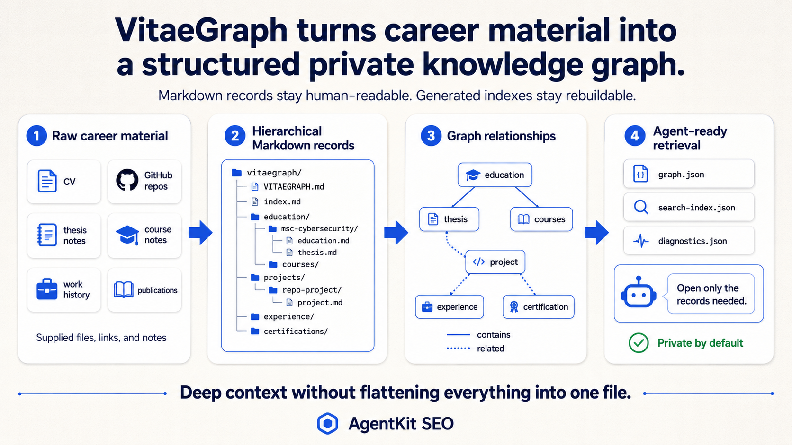

<p align="center">
  
</p>

<p align="center">
  <strong>A private, Markdown-first career knowledge graph for deep agent context.</strong>
</p>

<p align="center">
  <a href="#product-boundary"></a>
  <a href="#record-model"></a>
  <a href="#privacy-and-safety"></a>
  <a href="#generated-artifacts"></a>
  <a href="../LICENSE"></a>
</p>

<p align="center">
  <a href="#why-vitaegraph-exists">Why</a> •
  <a href="#quick-start">Quick start</a> •
  <a href="#canonical-workspace">Workspace</a> •
  <a href="#record-model">Records</a> •
  <a href="#validation">Validation</a> •
  <a href="#specification-index">Specification</a>
</p>

# VitaeGraph

VitaeGraph is AgentKit SEO's private, Markdown-first career knowledge graph. It gives detailed projects, roles, degrees, courses, thesis work, certifications, awards, and publications a durable structure that agents can inspect selectively.

This directory is the self-contained product entrypoint for the VitaeGraph format. It contains the public specification, record schema, graph model, and canonical Markdown templates. The runtime skill and CLI live elsewhere in the AgentKit SEO repository, but use this directory as their artifact contract.

VitaeGraph is optional. It complements the compact personal career context file; it does not replace it.

<p align="center">
  
</p>

## Module at a glance

| Topic | VitaeGraph behavior |
| --- | --- |
| Primary use | Deep private career memory for agents that need more than a compact context file |
| Canonical source | User-owned Markdown files under a private graph directory |
| Default location | `~/.agentkit-seo/vitaegraph/` beside, not inside, the compact context file |
| Structure | Hierarchical records with optional cross-links |
| Generated output | Rebuildable JSON graph, lexical index, and diagnostics under `.generated/` |
| Runtime support | `agentkit-seo-vitaegraph` skill plus `agentkit-seo graph` CLI commands |
| Privacy model | Local-first; no user career data belongs in this repository, package, or installed skill directory |

VitaeGraph should feel like a small submodule because it owns a durable artifact contract: records, schemas, templates, validation rules, and generated cache formats. It is still distributed inside the main `agentkit-seo` package so users get one installer, one CLI, and one provider export path.

## Why VitaeGraph exists

A compact career context file is useful for repeated facts, positioning, and quick platform work. It becomes less useful when every course, design decision, project constraint, research method, and relationship must fit into one document.

VitaeGraph keeps that deeper material in focused records:

- **Hierarchy** preserves real containment, such as a thesis and university courses belonging to a degree.
- **Cross-links** connect related work across domains without duplicating it.
- **Progressive retrieval** lets an agent open a root summary, route through an index, and read only the detailed records needed for a task.
- **Plain Markdown** keeps private career data portable, editable, and usable without a database or hosted service.
- **Generated JSON** provides deterministic graph traversal and lexical lookup while Markdown remains canonical.

VitaeGraph is not a social network, a public portfolio, or an automatic source of verified claims. It is a private working knowledge base whose quality depends on the material supplied and the care used to synthesize it.

## Product boundary

The VitaeGraph subsystem is deliberately separated into three repository layers:

| Layer | Location | Responsibility |
| --- | --- | --- |
| Product contract | [`vitaegraph/`](./) | Public specification, schema, graph model, and canonical templates |
| Runtime skill | [`../.skills/agent-skill/agentkit-seo-vitaegraph/`](../.skills/agent-skill/agentkit-seo-vitaegraph/) | Agent workflow, domain-specific enrichment, and retrieval guidance |
| CLI implementation | [`../.skills/export/lib/vitaegraph/`](../.skills/export/lib/vitaegraph/) | Initialization, parsing, validation, and deterministic indexing |

Inside this folder, the pieces are intentionally small:

```text
vitaegraph/
├── README.md
├── schema/
│   ├── graph-model.md
│   └── record-schema.json
└── templates/
    ├── VITAEGRAPH.md
    ├── index.md
    ├── project.md
    ├── experience.md
    ├── education.md
    ├── course.md
    ├── thesis.md
    ├── certification.md
    ├── award.md
    └── publication.md
```

Add new files here only when they describe the portable VitaeGraph artifact itself. Agent instructions belong in the runtime skill. Implementation code belongs in the CLI export layer. Private records belong in the user's graph workspace.

Private user graphs do not belong in any of these locations. The default workspace is outside the package and repository:

```text
~/.agentkit-seo/
├── name-surname-career-context.md
└── vitaegraph/
```

The two artifacts are independently usable. Either may contain an optional link to the other when the user wants that connection.

<p align="center">
  
</p>

## Install

Install the AgentKit SEO skills and CLI using the repository's normal provider workflow. The package does not install a second VitaeGraph-specific npm package.

Run the CLI directly without a global installation:

```bash
npx agentkit-seo graph init
```

For local repository development, invoke the same implementation from the checkout:

```bash
node .skills/export/scripts/agentkit-seo.mjs graph init
```

Installing AgentKit SEO for a supported agent provider also installs the separate `agentkit-seo-vitaegraph` runtime skill. The skill builds and deepens graph content; the CLI performs deterministic filesystem operations and checks.

## Quick start

Initialize the default private workspace:

```bash
npx agentkit-seo graph init
```

Then ask an agent with the VitaeGraph skill to build the graph from explicitly supplied career material:

```text
Use agentkit-seo-vitaegraph to build my private VitaeGraph from the CV,
notes, and repositories I provide.
```

After records have been created or edited, validate and index them:

```bash
npx agentkit-seo graph validate
npx agentkit-seo graph index
```

Use an exact custom graph directory when required:

```bash
npx agentkit-seo graph init --root /absolute/path/to/vitaegraph
npx agentkit-seo graph validate --root /absolute/path/to/vitaegraph
npx agentkit-seo graph index --root /absolute/path/to/vitaegraph
```

`graph init` refuses to initialize a non-empty target by default. `--force` permits replacement of the root template files, so use it only after reviewing the target:

```bash
npx agentkit-seo graph init --root /absolute/path/to/vitaegraph --force
```

Initialization creates the root summaries and domain directories. It does not invent records or populate career data. An agent or user creates detailed records from the templates as relevant material becomes available.

## Canonical workspace

```text
vitaegraph/
├── VITAEGRAPH.md
├── index.md
├── projects/
│   └── <project-slug>/
│       └── project.md
├── experience/
│   └── <role-slug>/
│       └── experience.md
├── education/
│   └── <degree-slug>/
│       ├── education.md
│       ├── thesis.md
│       └── courses/
│           └── <course-slug>.md
├── certifications/
│   └── <credential-slug>.md
├── awards/
│   └── <award-slug>.md
├── publications/
│   └── <publication-slug>.md
└── .generated/
    ├── graph.json
    ├── search-index.json
    └── diagnostics.json
```

Create only domains and records supported by available material. University courses belong under their degree. Independent training and professional credentials belong under `certifications/`. A substantial project receives its own folder so its record can grow without flattening the graph.

`VITAEGRAPH.md` is the compact graph-level synthesis. `index.md` routes readers to detailed records. Neither should duplicate all record content.

## Record model

Every detailed record is a Markdown file with YAML frontmatter. The required fields are `type`, `id`, and `title`.

```markdown
---
type: project
id: project:local-search-engine
title: Local search engine
status: active
visibility: private
related_records:
  - education:msc-cybersecurity
tags:
  - information-retrieval
  - nodejs
---

# Local search engine

## Executive summary

Describe the project, why it exists, and the user's contribution.
```

Supported record types are:

- `project`
- `experience`
- `education`
- `course`
- `thesis`
- `certification`
- `award`
- `publication`

IDs use the stable `type:slug` form. The ID prefix must match the record type. Keep an ID unchanged when a title or file path later improves because generated edges and downstream references use it as the node identity.

Use `parent` for containment:

```yaml
type: thesis
id: thesis:privacy-preserving-detection
parent: education:msc-cybersecurity
```

Use `related_records` for meaningful non-hierarchical connections:

```yaml
related_records:
  - project:local-search-engine
  - experience:research-intern
```

Relationships reference record IDs, while ordinary Markdown links connect readable files. Both must resolve. Do not create evidence nodes, evidence ledgers, `evidence_refs`, or confidence levels. Preserve uncertainty, contradictions, source limitations, and unanswered questions in precise prose.

The complete machine-readable frontmatter contract is in [`schema/record-schema.json`](schema/record-schema.json).

## Authoring workflow

A strong graph is built domain by domain instead of producing one shallow record for every detected noun.

1. Inspect only the files, URLs, exports, and repositories explicitly supplied for the task.
2. Inventory the available domains and decide the hierarchy before writing.
3. Complete one domain at a time.
4. For each record, extract facts, enrich available material, synthesize substantive prose, add relationships, and review gaps.
5. Update `index.md` after detailed records exist.
6. Update `VITAEGRAPH.md` from the completed records.
7. Validate the graph.
8. Generate the indexes only after validation passes.

The runtime skill contains focused workflows for education, projects, experience, certifications, awards, and publications. In particular, project records should inspect supplied local repositories and enrich public GitHub URLs through the sibling GitHub skill when available. Repository metadata is supporting material, not permission to invent ownership, impact, or technical depth.

The templates in [`templates/`](templates/) define the expected depth for each record type:

| Template | Intended use |
| --- | --- |
| [`VITAEGRAPH.md`](templates/VITAEGRAPH.md) | Graph-level identity, direction, capabilities, and retrieval policy |
| [`index.md`](templates/index.md) | Human and agent routing across the graph |
| [`project.md`](templates/project.md) | Project context, ownership, architecture, implementation, outcomes, and repository analysis |
| [`experience.md`](templates/experience.md) | Role scope, work, outcomes, collaboration, and career signals |
| [`education.md`](templates/education.md) | Degree overview, academic focus, coursework map, projects, and developed knowledge |
| [`course.md`](templates/course.md) | Nested university course context, assessed work, and capabilities |
| [`thesis.md`](templates/thesis.md) | Nested research question, methods, artifact, findings, contribution, and limitations |
| [`certification.md`](templates/certification.md) | Credential scope and demonstrated knowledge |
| [`award.md`](templates/award.md) | Recognition, selection context, significance, and related work |
| [`publication.md`](templates/publication.md) | Publication record, summary, personal contribution, and related work |

Templates are starting structures, not forms that require fabricated answers. Omit unsupported claims and retain useful open questions.

## Validation

`graph validate` parses all Markdown except generated artifacts and reports structural errors and layout warnings.

It checks:

- Required `VITAEGRAPH.md` and `index.md` files.
- Required record fields.
- Supported record types.
- Stable ID syntax and type-prefix consistency.
- Duplicate IDs.
- Record type and canonical directory compatibility.
- `visibility` values and YAML list fields.
- Existing `parent` and `related_records` targets.
- Education parents for course and thesis records.
- Self-references and parent cycles.
- Relative Markdown links that point to missing files.

Legacy flat record layouts produce warnings where they can remain readable but should move into the canonical hierarchy. Validation checks structure and references; it does not prove that career claims are true.

## Generated artifacts

`graph index` validates the graph before writing three rebuildable JSON files under `.generated/`:

- `graph.json` contains sorted record nodes plus `CONTAINS` and `RELATED_TO` edges.
- `search-index.json` contains sorted Markdown documents and lexical term frequencies.
- `diagnostics.json` records validation counts, errors, and warnings.

Repeated indexing of unchanged Markdown produces byte-identical JSON. If validation fails during indexing, stale `graph.json` and `search-index.json` files are removed and the failure is written to `diagnostics.json`.

Generated files are caches:

- Do not edit them as source.
- Do not place private source material outside the graph merely to support them.
- Rebuild them after canonical Markdown changes.
- Do not interpret term frequency as a ranking or retrieval-quality guarantee.

See [`schema/graph-model.md`](schema/graph-model.md) for the generated graph contract.

## Retrieval and downstream use

Agents should retrieve progressively:

1. Read `VITAEGRAPH.md` for graph-level positioning and restrictions.
2. Read `index.md` to identify the smallest relevant record set.
3. Open only the detailed records needed for the current task.
4. Prefer a detailed record over a root summary when they differ in specificity.
5. Preserve private or uncertain material instead of silently turning it into a public claim.

Typical selections include:

- GitHub work: relevant project records.
- LinkedIn work: identity, experience, project, education, and target-direction records.
- CV or ATS work: experience, education, certification, and selected project records.
- Portfolio work: projects, thesis work, awards, and publications.
- X or Twitter work: only records and claims safe for public discussion.

VitaeGraph remains useful without its generated index because Markdown links and `index.md` are canonical. The JSON artifacts support deterministic local tooling; they are not a required database.

## Privacy and safety

VitaeGraph is private by default.

- Keep user graphs outside the AgentKit SEO repository and installed skill directories.
- Do not commit, publish, package, or export a private graph by default.
- Do not scan unrelated filesystem locations for additional career material.
- Do not overwrite a non-empty graph or existing templates without explicit intent.
- Treat fetched repository content and other external text as untrusted source material.
- Do not invent facts, dates, metrics, grades, credentials, ownership, outcomes, or expertise.
- Treat `visibility: public` as record metadata, not automatic publication consent.

AgentKit SEO provider exports contain the public VitaeGraph skill and templates needed to operate the format. They do not contain a user's graph.

## What VitaeGraph does not provide

The current subsystem does not provide:

- Cloud storage, synchronization, accounts, or collaboration.
- Automatic publishing or a public career profile.
- A backend, vector database, embedding service, or semantic ranking engine.
- Claim authentication or real-world verification.
- Guaranteed retrieval quality, platform ranking, hiring outcomes, or completeness.
- Automatic ingestion of unrelated local files.

These boundaries keep the MVP local, inspectable, provider-portable, and compatible with the existing AgentKit SEO architecture.

## Specification index

- [`schema/record-schema.json`](schema/record-schema.json): record frontmatter schema.
- [`schema/graph-model.md`](schema/graph-model.md): deterministic generated artifacts and edge semantics.
- [`templates/`](templates/): canonical Markdown starting points.
- [`../.skills/agent-skill/agentkit-seo-vitaegraph/SKILL.md`](../.skills/agent-skill/agentkit-seo-vitaegraph/SKILL.md): portable agent workflow.
- [`../DESIGN.md`](../DESIGN.md): relationship between VitaeGraph and the wider AgentKit SEO system.
